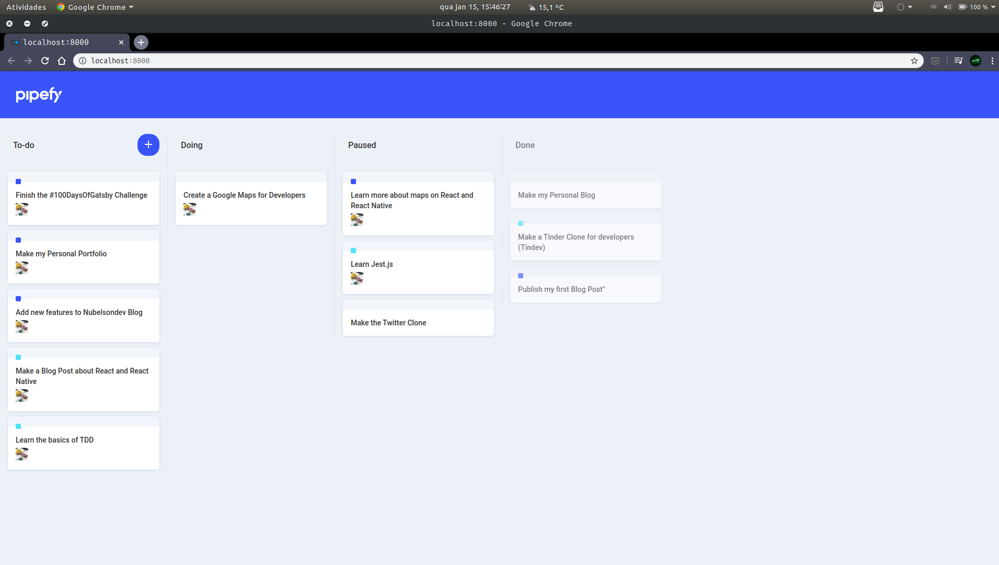

# Pipefy (Frontend w/ React.js)



This is the simple clone of Pipefy's interface using drag and drop functionality.

## Getting Started

These instructions will get you a copy of the project up and running on your local machine for development and testing purposes. Feel free to deploy if you want.

### Prerequisites

For this object all you have to do is clone it and run it.

### Installation

Clone the repository and run

```javascript
// With NPM
$ npm install
$ npm run start
// or
$ gatsby develop

// With Yarn
$ yarn install
$ yarn start
// or
$ gatsby develop
```

## Built With

-   [GatsbyJS](https://www.gatsbyjs.org/)
-   [ReactJS](https://reactjs.org/)
-   [React-icons](https://react-icons.netlify.com/#/)
-   [React-dnd](https://react-dnd.github.io/react-dnd/about)
-   [Styled-Comonents](https://styled-components.com/)

## Contributing

Please feel free to send pull request if you want to contribute!

## Authors

-Nubelson - _Development_ - [nubelsondev](https://github.com/nubelsondev)
